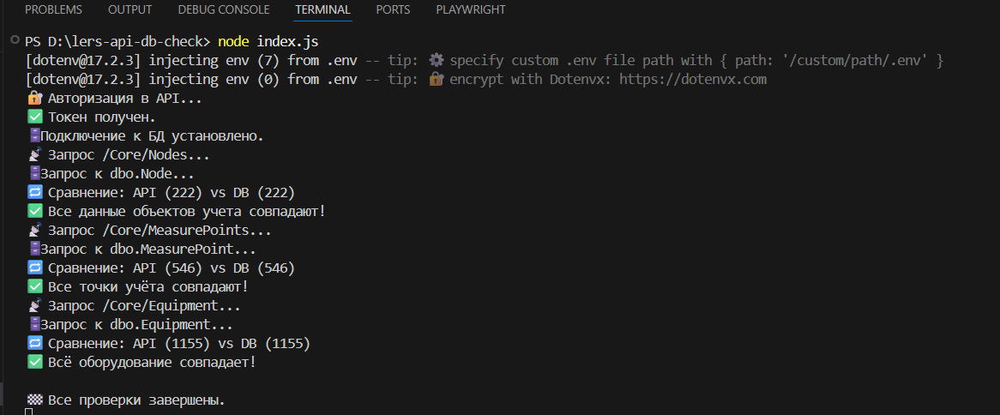
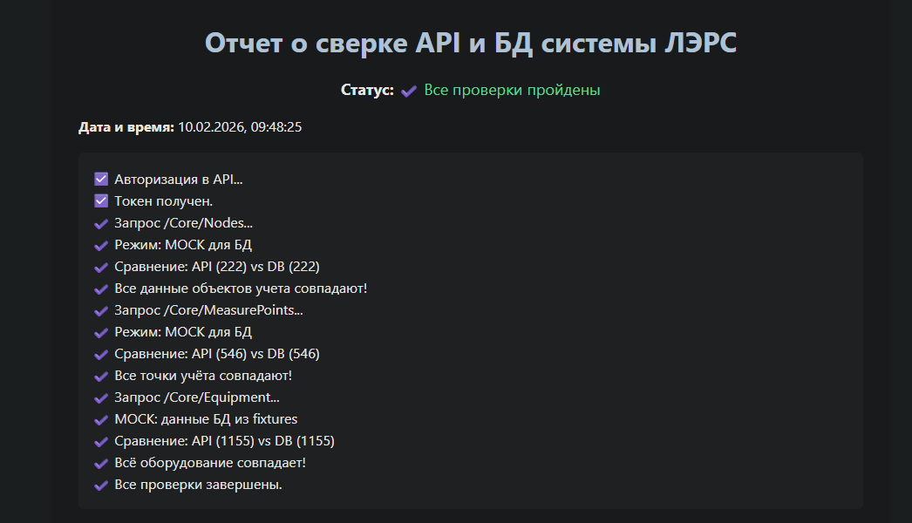

# 🚩 Сверка данных API и DB (ЛЭРС)

[](https://github.com/cheryst24-code-qa/lers-api-db-check/blob/main/LICENSE)

Автоматизированный инструмент для проверки согласованности данных между REST API и базой данных MS SQL Server системы **«ЛЭРС УЧЁТ»**.  
Проверяет соответствие трёх ключевых сущностей:

- Объекты учёта (`/Core/Nodes` <-> `dbo.Node`)
- Точки учёта (`/Core/MeasurePoints` <-> `dbo.MeasurePoint`)
- Оборудование (`/Core/Equipment` <-> `dbo.Equipment`)

## 🎯 Цель проекта

Обеспечить надёжную валидацию того, что данные, отображаемые в API, точно соответствуют данным в БД - критически важная задача для систем учёта энергоресурсов.

## ✅ Реализованные возможности

| Функция | Описание |
|--------|---------|
| ✅ Авторизация в API | Поддержка `/api/v1/Login` |
| ✅ Сравнение 3 сущностей | Nodes, MeasurePoints, Equipment |
| ✅ Обработка различий в именовании полей | `Name` (БД) <-> `title` (API) |
| ✅ Нормализация `"null"` -> `null` | Корректное сравнение пустых значений |
| ✅ HTML-отчёт | Красивый, самодостаточный отчёт в браузере |
| ✅ Автоматическое открытие отчёта | При локальном запуске |
| ✅ Mock-режим для БД | Возможность запуска в CI/CD без доступа к БД |
| ✅ GitHub Actions | Ежедневная автоматическая проверка |
| ✅ Артефакты отчётов | Сохранение результатов в GitHub |

## 📂 Структура проекта

    lers-api-db-check/
    ├── .github/workflows
    │ └── api-db-check.yml
    ├── index.js                # точка входа
    ├── lib/db.js               # подключение к БД
    ├── checks/                 # модули проверок
    │ ├── nodes.js
    │ ├── measure-points.js
    │ └── equipment.js
    ├── fixtures/               # фикстуры для mock-режима
    │ ├── db-nodes.json
    │ ├── db-measure-points.json
    │ └── db-equipment.json
    ├── reports/                # генерируемые HTML-отчёты
    ├── docs/                   # скриншоты
    │ ├── success-run.png
    │ └── report.png
    ├── .env.example            # шаблон переменных
    ├── .gitignore
    └── README.md

---

## 📦 Требования

- Node.js v18+
- [dotenvx](https://dotenvx.com) ( для безопасной работы с `.env`)
- Доступ к ЛЭРС API
- Доступ к MS SQL Server (БД `LERS`) — **только для локального режима**

 💡 Установите dotenvx глобально, **если это требование вашей команды или вы хотите использовать расширенные функции безопасности**::  
 ```bash
npm install -g @dotenvx/dotenvx
 ```
> 📌 Для базового использования достаточно стандартного пакета `dotenv` (он уже включён в зависимости проекта).

---

## 📥 Установка

### Вариант 1: Клонирование существующего репозитория

```bash
git clone https://github.com/ваш-ник/lers-api-db-check.git
cd lers-api-db-check
npm install
```
> 📌 Пропустите шаги инициализации Git - они уже выполнены при клонировании

### Вариант 2: Создание нового репозитория с нуля
```bash
    mkdir lers-api-db-check
    cd lers-api-db-check
    git init
    npm init -y
    # ... скопируйте файлы проекта ...
    npm install
    git add .
    git commit -m "feat: initial commit of LERS API-DB validator"
    git remote add origin https://github.com/ваш-ник/lers-api-db-check.git
    git branch -M main
    git push -u origin main
```
---

## ⚙️ Настройка

### Создайте файл .env на основе шаблона .env.example.

Пример .env.example:
```env
    # Реальный режим (локально)
    DB_SERVER=localhost\\SQLEXPRESS
    DB_DATABASE=LERS
    DB_USER=qa_reader
    DB_PASSWORD=ваш_пароль

    API_BASE_URL=http://85.444.100.222:11000
    API_LOGIN=usertest
    API_PASSWORD=ваш_пароль_api

    # Для CI/CD или offline-режима
    MOCK_DB=false
```
### Offline-режим (без доступа к БД)
    Используйте фикстуры вместо реального подключения к базе данных:
```env
    API_BASE_URL=http://85.444.100.222:11000
    API_LOGIN=usertest
    API_PASSWORD=ваш_пароль_api
    MOCK_DB=true
```
### Обновите .gitignore
Убедитесь, что в .gitignore есть:
```gitignore
    .env
    node_modules/
    npm-debug.log*
```
> 📌 Никогда не коммитьте .env в репозиторий!

---

## ▶️ Запуск
```bash
    node index.js
```
> 📌 Отчёт автоматически откроется в браузере.

---

## 🔐 Безопасность
- Используйте учётные записи с минимально необходимыми правами.
- Никогда не коммитьте .env в репозиторий.
- В CI/CD используйте GitHub Secrets для хранения чувствительных данных.

---

## 🌐 GitHub Actions (CI/CD)
Workflow запускается:
- При пуше в main,
- Вручную через UI,
- Ежедневно в 11:00 МСК.
Результаты:
- Сохраняются как артефакты,
- Доступны для скачивания из Actions.

> 📌 После первого пуша workflow активируется автоматически.

---

## 🖥️ Пример выполнения

| Успешный запуск скрипта |
|-------------------------|
|  |

Скрипт выполняет сравнение всех сущностей и завершается с кодом 0 при отсутствии расхождений.

---

## 📊 Отчет о выполнения

| Пример отчета |
|-------------------------|
|  |

✅ Проект готов к использованию в QA-процессах и демонстрации в портфолио.